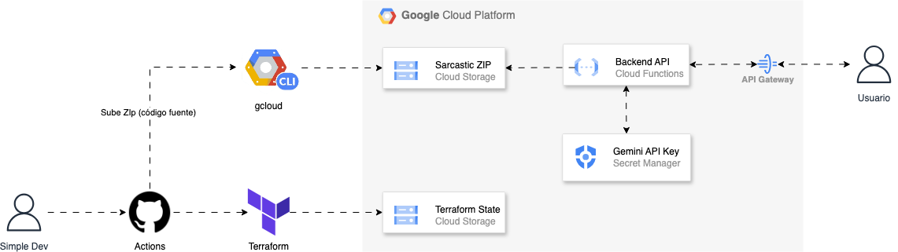

# Proyecto: API Serverless con Gemini y Terraform en Google Cloud Functions

## Descripción

Este proyecto demuestra cómo desplegar una **API Serverless** utilizando **Google Cloud Functions**, **Terraform** y **GitHub Actions**. La API tiene como objetivo proporcionar respuestas sarcásticas a través del **Gemini API** de Google, usando **Typescript** y desplegada de manera eficiente y automática en Google Cloud Platform (GCP).

El enfoque principal es automatizar la infraestructura y la gestión de despliegues mediante Terraform, mientras que la API responde solicitudes de los usuarios en tiempo real.

### Arquitectura

El sistema está compuesto por varios componentes claves en GCP:

- **Google Cloud Functions:** Gestiona el backend de la API Serverless.
- **API Gateway:** Exponer la API al público, gestionando las solicitudes y encaminándolas a Cloud Functions.
- **Cloud Storage:** Almacena el archivo `.zip` que contiene el código de la API, para ser desplegado a través de Terraform.
- **Secret Manager:** Gestiona el acceso a la clave API de Gemini, que es utilizada para generar respuestas sarcásticas.
- **Terraform:** Proporciona la infraestructura como código (IaC) para crear y gestionar los recursos de GCP.
- **GitHub Actions:** Automatiza el proceso de despliegue desde el código hasta la infraestructura, con Terraform y el Google Cloud CLI.

A continuación se incluye la imagen con la arquitectura completa:

### Funcionamiento

1. **Despliegue Automatizado:**

   - GitHub Actions maneja el proceso de despliegue de manera automatizada cada vez que se realiza un push a la rama `main`.
   - Los archivos de Terraform se ejecutan para crear los recursos en GCP, incluyendo las funciones y el bucket de almacenamiento.
   - El archivo `.zip` con el código de la API se sube automáticamente a GCS (Google Cloud Storage).
   - El archivo de Terraform se asegura de configurar correctamente todos los servicios necesarios y conecta el secreto de la API de Gemini a la función de Cloud Functions.

2. **Funcionalidad de la API:**
   - La API responde con respuestas sarcásticas basadas en el texto ingresado. Esta funcionalidad está respaldada por el **Gemini API** de Google.
   - **Swagger** está integrado para documentar la API, permitiendo que los usuarios vean los endpoints disponibles y los parámetros que pueden enviar.

### Requisitos

- **Google Cloud Platform (GCP)**: Necesitarás tener una cuenta activa en GCP.
- **Terraform**: Debes tener **Terraform** instalado para poder gestionar la infraestructura.
- **GitHub Actions**: Necesitarás configurar una cuenta de GitHub y un repositorio para integrar la pipeline de CI/CD.
